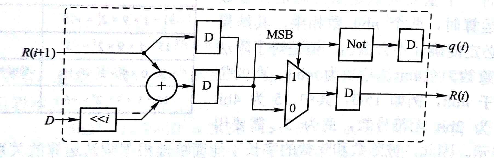

# 基于迭代单元的除法器

## 迭代单元

数字信号处理中，有大量的算法是基于迭代算法，即下一次的运算需要上一次运算的结果，将运算部分固化为迭代单元可以将数据处理和流程控制区分，更容易做出时序和面积优化更好的硬件描述，这次将基于迭代单元构造恢复余数和不恢复余数除法器

## 恢复余数除法器

### 迭代单元

#### 算法

1. 将除数移位i位
2. 判断位移后的除数与余数大小
3. 若位移除数大于余数，则余数输出当前余数，结果输出0；否则输出余数减位移除数，结果输出1



#### RTL代码

```verilog
module restore_cell #(
	parameter WIDTH = 4,
	parameter STEP = 1
)(
	input clk,
	input rst_n,

	input [WIDTH * 3 - 1:0]remainder_din,
	input [WIDTH - 1:0]divisor,

	output reg [WIDTH * 3 - 1:0]remainder_dout,
	output reg quotient
);

wire [WIDTH * 3:0]divisor_exd = '{divisor};
wire [WIDTH * 3:0]sub = {1'b0,remainder_din} - (divisor_exd << STEP);

always @ (posedge clk or negedge rst_n) begin
	if(~rst_n) begin
		{remainder_dout,quotient} <= 'b0;
	end else begin
		if(sub[WIDTH * 3] == 1'b0) begin
			remainder_dout = sub;
		end else begin
			remainder_dout = remainder_din;
		end
		quotient = ~(sub[3 * WIDTH]);
	end
end

endmodule
```

### 顶层模块

```verilog
module restore_cell_divider #(
	parameter WIDTH = 4
)(
	input clk,    // Clock
	input rst_n,  // Asynchronous reset active low

	input [2 * WIDTH - 1:0]dividend,
	input [WIDTH - 1:0]divisor,

	output [2 * WIDTH - 1:0]dout,
	output [WIDTH - 1:0]remainder
);

genvar i;
generate
	for (i = 2 * WIDTH - 1; i >= 0; i = i - 1) begin:restore
		wire [3 * WIDTH - 1:0]last_remaider;
		wire [3 * WIDTH - 1:0]this_remaider;
		if(i == 2 * WIDTH - 1) begin
			assign last_remaider = '{dividend};
		end else begin
			assign last_remaider = restore[i + 1].this_remaider;
		end
		restore_cell #(
			.WIDTH(WIDTH),
			.STEP(i)
		) u_restore_cell (
			.clk(clk),
			.rst_n(rst_n),

			.remainder_din(last_remaider),
			.divisor(divisor),

			.remainder_dout(this_remaider),
			.quotient(dout[i])
		);
	end
endgenerate

assign remainder = restore[0].this_remaider[WIDTH - 1:0];

endmodule
```

## 不恢复余数除法器

### 迭代单元

#### 算法

1. 将除数移位i位
2. 若余数大于0，余数输出余数减移位除数；否则余数输出余数加移位除数。结果输出余数符号位取反


#### RTL代码

```verilog
module norestore_cell #(
	parameter WIDTH = 4,
	parameter STEP = 1
)(
	input clk,
	input rst_n,

	input [WIDTH * 3:0]remainder_din,
	input [WIDTH - 1:0]divisor,

	output reg [WIDTH * 3:0]remainder_dout,
	output reg quotient
);

wire [WIDTH * 3:0]divisor_exd = '{divisor};
wire [WIDTH * 3:0]divisor_move = divisor_exd << STEP;
wire [WIDTH * 3:0]sub = remainder_din - divisor_move;
wire [WIDTH * 3:0]add = remainder_din + divisor_move;

always @ (posedge clk or negedge rst_n) begin
	if(~rst_n) begin
		{remainder_dout,quotient} <= 'b0;
	end else begin
		if(remainder_din[3 * WIDTH] == 'b0) begin
			remainder_dout = sub;
			quotient = ~(sub[3 * WIDTH]);
		end else begin
			remainder_dout = add;
			quotient = ~(add[3 * WIDTH]);
		end
	end
end

endmodule
```

### 顶层模块

```verilog
module norestore_cell_divider #(
	parameter WIDTH = 4
)(
	input clk,    // Clock
	input rst_n,  // Asynchronous reset active low

	input [2 * WIDTH - 1:0]dividend,
	input [WIDTH - 1:0]divisor,

	output [2 * WIDTH - 1:0]dout,
	output reg [WIDTH - 1:0]remainder
);

genvar i;
generate
	for (i = 2 * WIDTH - 1; i >= 0; i = i - 1) begin:restore
		wire [3 * WIDTH:0]last_remaider;
		wire [3 * WIDTH:0]this_remaider;
		if(i == 2 * WIDTH - 1) begin
			assign last_remaider = '{dividend};
		end else begin
			assign last_remaider = restore[i + 1].this_remaider;
		end
		norestore_cell #(
			.WIDTH(WIDTH),
			.STEP(i)
		) u_restore_cell (
			.clk(clk),
			.rst_n(rst_n),

			.remainder_din(last_remaider),
			.divisor(divisor),

			.remainder_dout(this_remaider),
			.quotient(dout[i])
		);
	end
endgenerate

wire [3 * WIDTH:0]remainder_final = restore[0].this_remaider;
always @ (*) begin
	if(remainder_final[3 * WIDTH] == 1'b0) begin
		remainder = remainder_final[WIDTH - 1:0];
	end else begin
		remainder = remainder_final[WIDTH - 1:0] + divisor;
	end
end

endmodule
```

需要注意的是，不恢复余数除法器最后需要调整余数为正