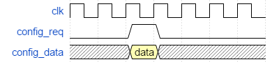
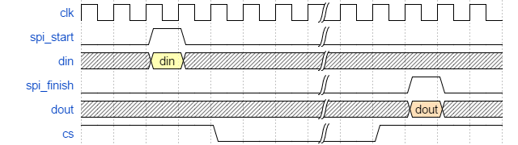

# 参数化SPI主机——从机

## 描述

参数化的SPI主机，时钟频率参数化，发送模式和发送bit数可配置

## 端口定义

### 主机

| 名称          | 类型     | 位宽                     | 描述            |
| ----------- | ------ | ---------------------- | ------------- |
| clk         | input  | 1                      | 系统时钟          |
| rst_n       | input  | 1                      | 系统复位          |
| spi_start   | input  | 1                      | spi启动信号，高电平有效 |
| spi_finish  | output | 1                      | spi结束标记，高电平有效 |
| sck         | output | 1                      | spi总线         |
| cs          | output | 1                      | spi使能信号       |
| mosi        | output | 1                      | spi主机到从机数据通路  |
| miso        | input  | 1                      | spi从机到主机数据通路  |
| config_req  | input  | 1                      | 配置使能信号，高有效    |
| config_data | input  | SPI_MAX_WIDTH_LOG+2    | 配置数据          |
| din         | input  | 2 ** SPI_MAX_WIDTH_LOG | 输入数据          |
| dout        | output | 2 ** SPI_MAX_WIDTH_LOG | 输出数据          |

### 从机

| 名称          | 类型     | 位宽                     | 描述             |
| ----------- | ------ | ---------------------- | -------------- |
| clk         | input  | 1                      | 系统时钟           |
| rst_n       | input  | 1                      | 系统复位           |
| spi_start   | output | 1                      | spi被启动信号，高电平有效 |
| spi_finish  | output | 1                      | spi结束标记，高电平有效  |
| sck         | input  | 1                      | spi总线          |
| cs          | input  | 1                      | spi使能信号        |
| mosi        | input  | 1                      | spi主机到从机数据通路   |
| miso        | output | 1                      | spi从机到主机数据通路   |
| config_req  | input  | 1                      | 配置使能信号，高有效     |
| config_data | input  | SPI_MAX_WIDTH_LOG+2    | 配置数据           |
| din         | input  | 2 ** SPI_MAX_WIDTH_LOG | 输入数据           |
| dout        | output | 2 ** SPI_MAX_WIDTH_LOG | 输出数据           |

## 接口时序

### 接口配置

### SPI传输

#### 主机

#### 从机

## 参数化变量

| 参数名                   | 功能                                     | 默认值  |
| --------------------- | -------------------------------------- | ---- |
| SPI_MAX_WIDTH_LOG（主从） | SPI可配置的最大位宽为$2^{SPI\_MAX\_WIDTH\_LOG}$ | 4    |
| SPI_SCAIL_LOG（仅主机）    | SPI时钟是系统时钟的$2^{SPI\_SCAIL\_LOG}$       | 8    |

## 配置

| 位数                    | 功能       |
| --------------------- | -------- |
| SPI_MAX_WIDTH_LOG + 2 | cpol     |
| SPI_MAX_WIDTH_LOG + 1 | cpha     |
| SPI_MAX_WIDTH_LOG     | spi发送的位宽 |

