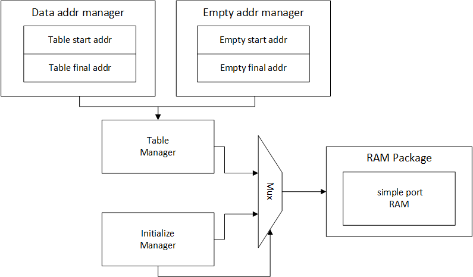
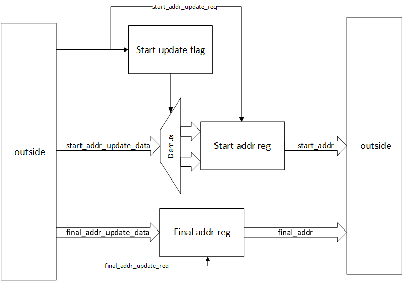
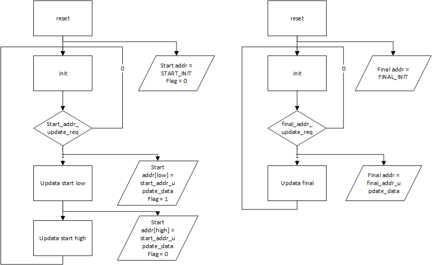
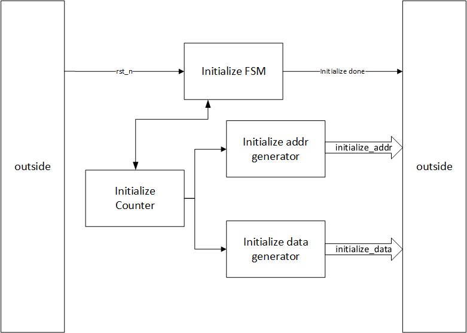
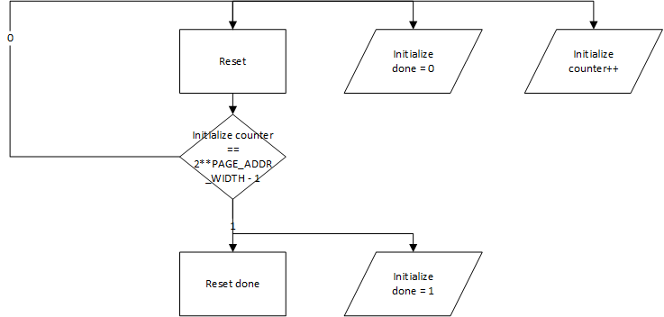
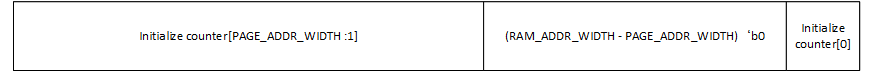
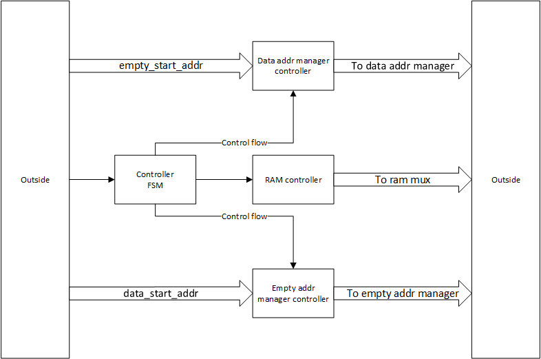

# RAM设计需求

使用硬件地址管理，在单口ram中实现每个节点大小固定（可配置）的链表FIFO数据结构，功能包括：

- 从链表头处出队列，从链表尾处入队列
- FIFO满信号和FIFO空信号
- ram宽度，深度，每个链表节点尺寸均可配置

# 参数表

| 参数名称            | 参数功能                   | 默认值  |
| --------------- | ---------------------- | ---- |
| RAM_WIDTH       | RAM数据位宽                | 8    |
| RAM_ADDR_WIDTH  | RAM地址位宽                | 16   |
| PAGE_ADDR_WIDTH | 节点开头地址位宽（RAM地址位宽的高位部分） | 12   |

# 数据结构

RAM内的数据结构如下表所示（PAGE_ADDR为该节点起始地址）

| 地址            | 标号             | 功能             |
| ------------- | -------------- | -------------- |
| PAGE_ADDR     | NODE_NEXT_LOW  | 下一节点地址的低WIDTH位 |
| PAGE_ADDR + 1 | NODE_NEXT_HIGH | 下一节点地址的其余高位    |
| other         | NODE_DATA      | 数据             |

# 设计结构

- Data addr manager：链表地址管理模块
- Empty addr manager：空闲地址管理模块
- Table manager：系统控制模块
- Initialize manager：初始化控制模块
- mux：RAM控制权仲裁器
- RAM package：包装过的ram模块

## 地址管理模块（addr manager）

### 需求

- 读取链表后，将start addr寄存器中的值更新为链表下一节点地址：{NODE_NEXT_HIGH,NODE_NEXT_LOW}
- 写入链表后，将final addr寄存器中的值更新为当前节点的值

### IO端口

| 端口名称                   | 位宽              | 类型     | 描述                 |
| ---------------------- | --------------- | ------ | ------------------ |
| clk                    | 1               | input  | 系统时钟               |
| rst_n                  | 1               | input  | 系统复位               |
| start_addr_update_req  | 1               | input  | start addr刷新请求，高有效 |
| start_addr_update_data | RAM_WIDTH       | input  | start addr刷新数据     |
| start_addr             | PAGE_ADDR_WIDTH | output | start addr数据输出     |
| final_addr_update_req  | 1               | input  | final addr刷新请求，高有效 |
| final_addr_update_data | PAGE_ADDR_WIDTH | input  | final addr刷新数据     |
| final_addr             | PAGE_ADDR_WIDTH | output | final addr数据输出     |

### 结构框图

- start update flag：标记寄存器，标记当前输入的部分是高位还是低位部分
- start/final addr reg：地址寄存器，用于存储队列头（start）和队列尾指针
- \*\_update\_req：刷新信号，当有效时根据update data刷新地址寄存器

### 功能描述

#### 起始地址管理

- 初始化下：start_addr初值为可配置的参数（根据负责数据队列还是空闲地址队列决定），flag置0
- update\_req有效时：
  - flag=0：update\_data载入start\_addr低位，flag置1
  - flag=1：update_data载入start_addr高位，flag值0

#### 结束地址管理

- 初始化下，finial_addr初值为可配置参数（根据负责数据队列还是空闲地址队列决定）
- update_req有效时，将update_data载入final_addr

#### 地址初值

| 模式     | start addr初值 | finials addr初值 |
| ------ | ------------ | -------------- |
| 数据队列   | 0            | 0              |
| 空闲地址队列 | 0            | RAM中随后一个节点的地址  |

## 初始化管理模块（initialize manager）

### 需求

- 仅在rst_n有效后执行一次
- 对RAM中的每个节点进行初始化，即将每个节点的NEXT_NODE字段置为下一个节点的地址（建立一个容量覆盖整个RAM的空闲地址列表）
- 在初始化过程中获取RAM控制权，初始化完成后释放

### IO端口

| 端口名称            | 位宽             | 类型     | 描述                       |
| --------------- | -------------- | ------ | ------------------------ |
| clk             | 1              | input  | 系统时钟                     |
| rst_n           | 1              | input  | 系统复位使能，低有效               |
| initialize_done | 1              | output | 系统初始化完成标志/RAM控制权获取请求，高有效 |
| initialize_addr | RAM_ADDR_WIDTH | output | RAM初始化地址输入               |
| initialize_data | RAM_WIDTH      | output | RAM初始化数据输入               |

### 结构框图

- initialize FSM：管理初始化的状态机，控制初始化计数器counter并控制初始化完成标志initialize done
- initialize counter：初始化计数器，产生从0开始到`2**PAGE_ADDR_WIDTH - 1`，溢出时初始化完成。
- initialize addr generator：初始化地址生成器，根据initialize counter的值生成初始化地址
- initialize data generator：初始化数据生成器，根据initialize counter的值生成初始化数据

### 功能描述

#### initialize FSM与initialize counter

该模块为一个从0计数到`2**(PAGE_ADDR_WIDTH + 1) - 1`的计数器，仅在rst_n有效复位后运行一次，之后initialize done信号拉高，改计数器不再运行

#### initialize addr generator

初始化地址生成器，生成的地址为：

#### initialize data addr

初始化数据生成器，根据counter的值生成该地址需要的值，即下一个节点的部分地址，下一个节点地址为

| counter[PAGE_ADDR_WIDTH:1] | 数据：下一节点地址(INIT_ADDR) |
| -------------------------- | -------------------- |
| 2**PAGE_ADDR_WIDTH - 1     | 本节点地址                |
| 其他节点                       | 下一个节点地址              |

counter生成的数据为：

- initializer_counter[0] = 0时，为INIT_ADDR[WIDTH - 1:0]
- intializer_counter[1] = 1时，为'{INIT_ADDR[PAGE_ADDR_WIDTH:WIDTH]}

## 系统控制模块(system controller)

### 需求

- 当外部有写请求时：向空闲地址链表头处申请空闲节点，将写数据存入该节点，将该节点从尾部插入数据链表
- 当外部有读请求时：从数据链表头处获取数据节点，将数据输出，并将该节点从尾部插入空闲地址链表

### IO端口

| 端口名称                         | 位宽              | 类型     | 描述                       |
| ---------------------------- | --------------- | ------ | ------------------------ |
| clk                          | 1               | input  | 系统时钟信号                   |
| res_n                        | 1               | input  | 系统复位信号                   |
| link_write_req               | 1               | input  | 外部写请求                    |
| link_read_req                | 1               | input  | 外部读请求                    |
| data_start_addr_update_req   | 1               | output | 数据链表start addr刷新请求，高有效   |
| data_start_addr              | PAGE_ADDR_WIDTH | input  | 数据链表start addr数据输入       |
| data_final_addr_update_req   | 1               | output | 数据链表final addr刷新请求，高有效   |
| data_final_addr_update_data  | PAGE_ADDR_WIDTH | output | 数据链表final addr刷新数据       |
| data_final_addr              | PAGE_ADDR_WIDTH | input  | 数据链表final addr数据输入       |
| empty_start_addr_update_req  | 1               | input  | 空闲地址链表start addr刷新请求，高有效 |
| empty_start_addr             | PAGE_ADDR_WIDTH | output | 空闲地址链表start addr数据输出     |
| empty_final_addr_update_req  | 1               | input  | 空闲地址链表final addr刷新请求，高有效 |
| empty_final_addr_update_data | PAGE_ADDR_WIDTH | input  | 空闲地址链表final addr刷新数据     |
| empty_final_addr             | PAGE_ADDR_WIDTH | output | 空闲地址链表final addr数据输出     |
| ram_write_req                | 1               | output | RAM写请求，高有效               |
| ram_addr                     | RAM_ADDR_WIDTH  | output | RAM地址                    |
| ram_controller_write_req     | 1               | output | controller写RAM请求，高有效     |
| ram_controller_write_data    | RAM_WIDTH       | output | controller写RAM数据         |

### 结构框图

### 功能描述

#### 核心状态机

