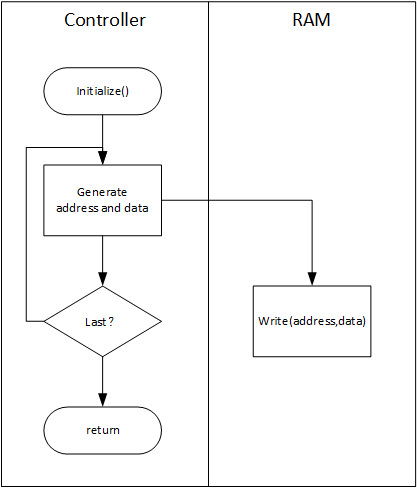
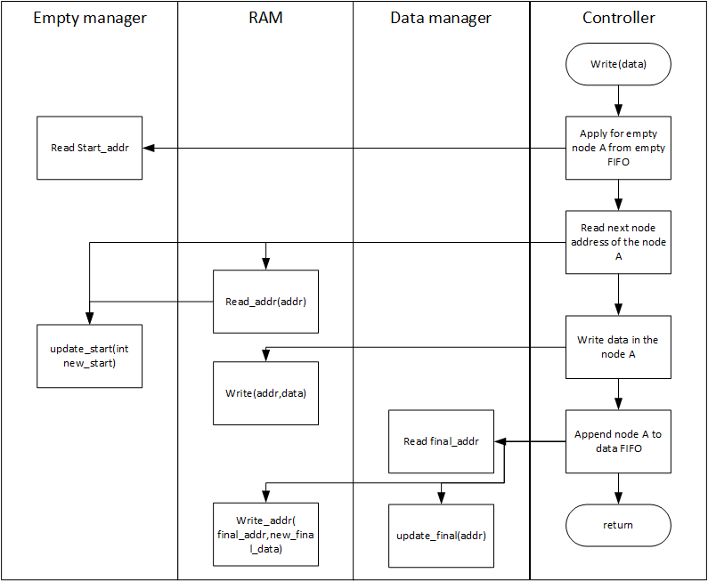
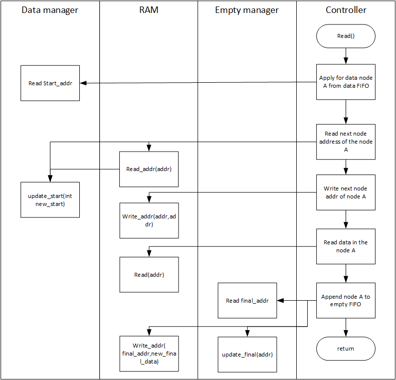

# 软件建模需求

建立一个软件模型，在事物级对硬件链表FIFO管理器的各个部分进行建模，包括：

- RAM模型
- 链表地址管理模型
- 系统模型

能够模拟的行为包括：

- 初始化
- 外部读
- 外部写

# 技术路线选择

| 项目   | 技术路线       |
| ---- | ---------- |
| 建模语言 | python 3.5 |
| 第三方库 | numpy      |

# 软件建模结构


平台由三个类组成：

- hardware_link_model：对controller和initialize的建模
- addr_manager：对addr_manager的建模，负责管理start_addr和final_addr
- ram_model：对RAM建模，包括读和写

# 模型运行流程

## initialize



## write



## read



# 代码实现

## 基本数据结构——结点

```python
class node_data(object):
    """docstring for node_data"""

    def __init__(self, page_capacity_width=4):
        super(node_data, self).__init__()
        page_capacity = 2 ** page_capacity_width - 2
        self.data = np.zeros(page_capacity)
        self.next_node = 0
```

| 属性        | 类型      | 功能     |
| --------- | ------- | ------ |
| data      | ndarray | 数据     |
| next_node | number  | 下一节点地址 |

## hardware_link_model

### 构造方法

| 属性                 | 类型                 | 功能          |
| ------------------ | ------------------ | ----------- |
| ram                | class:ram_model    | 软件ram模型     |
| data_addr_manager  | class:addr_manager | 数据FIFO管理器   |
| empty_addr_manager | class:addr_manager | 空白地址FIFO管理器 |
| ram_cap            | number             | ram容量       |

```python
def __init__(self, ram_cap=8):
    super(hardware_link_model, self).__init__()
    self.ram = ram_model(ram_cap)
    self.data_addr_manager = addr_manager(start=0, final=0)
    self.empty_addr_manager = addr_manager(start=0, final=2 ** ram_cap - 1)
    self.ram_cap = 2 ** ram_cap
```

### initialize方法

初始化ram

```python
def initializer(self):
    for i in range(self.ram_cap - 1):
        self.ram.write(i, node_data(i + 1))
    self.ram.write(self.ram_cap - 1, node_data(self.ram_cap - 1))
```

### write方法

输入din(ndarray)，将该数据插入FIFO数据链表的尾部

```python
def write(self, din):
    # Apply for empty node A from empty FIFO
    node_addr = self.empty_addr_manager.start_addr
    # Read next node address of the node A
    next_node_addr = self.ram.read_addr(node_addr)
    self.empty_addr_manager.update_start(next_node_addr)
    # Write data in the node A
    node = node_data(node_addr)
    node.data = din
    self.ram.write(node_addr, node)
    # Append node A to data FIFO
    last_final_addr = self.data_addr_manager.final_addr
    self.ram.write_addr(last_final_addr, node_addr)
    self.data_addr_manager.update_final(node_addr)
```

### read方法

返FIFO数据链表头部的数据

```python
def read(self):
    # Apply for data node A from empty FIFO
    node_addr = self.data_addr_manager.start_addr
    # Read next node address of the node A
    next_node_addr = self.ram.read_addr(node_addr)
    self.data_addr_manager.update_start(next_node_addr)
    # Write next node addr of node A
    self.ram.write_addr(node_addr, node_addr)
    # Read data in the node A
    node = self.ram.read(node_addr)
    # Append node A to empty FIFO
    last_final_addr = self.empty_addr_manager.final_addr
    self.ram.write_addr(last_final_addr, node_addr)
    self.empty_addr_manager.update_final(node_addr)
    return node.data
```

## addr manger

### 构造方法

```python
def __init__(self, start, final):
    super(addr_manager, self).__init__()
    self.start_addr = start
    self.final_addr = final
```

### updata方法

```python
def update_start(self, data):
    self.start_addr = data
def update_final(self, data):
    self.final_addr = data
```

## ram_model

### 构造方法

```python
def __init__(self, cap):
    super(ram_model, self).__init__()
    self.data = [node_data(0) for _ in range(2 ** cap)]
```

### 读方法

```python
def read(self, addr):
    return self.data[addr]
    
def read_addr(self, addr):
    return self.data[addr].next_node
```

### 写方法

```python
def write(self, addr, data):
    self.data[addr] = data
    
def write_addr(self, addr, data):
    self.data[addr].next_node = data
```

## simulation

### debug函数

```python
def fifo_debug(model, addr):
    print("this:", addr, model.ram.data[addr])
    if model.ram.read_addr(addr) != addr:
        fifo_debug(model, model.ram.read_addr(addr))
    else:
        return

```

### 随机数据写入

```python
def ramdom_write(model):
    din = np.random.randn(2**4 - 2)
    model.write(din)
```

